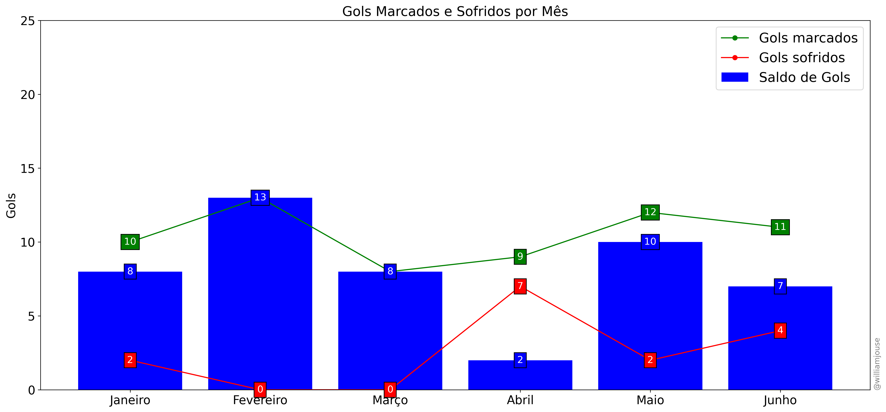
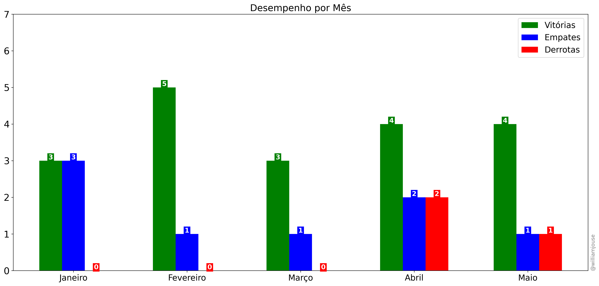

# Dados dos jogos do Flamengo temporada 2024

Nesse repositório são encontradas tabelas com informações e análises sobre os jogos do Flamengo na temporada 2024. A tabela [matches_FLA2024.csv](https://github.com/williamjouse/jogos-Flamengo-2024/blob/main/data/raw/matches_FLA2024.csv)
contém as seguintes colunas:

- id_match: ID do jogo
- home_team: Time mandante
- away_team: Time visitante
- home_score: Gols marcado pelo mandante
- away_score: Gols marcado pelo visitante
- tournament: Torneio ou competição e rodada
- kick-off: Data e hora da partida
- stadium: Estádio da partida
- attendance: Público da partida


Na segunda tabela de nome [goal_scorers_2024.csv](https://github.com/williamjouse/jogos-Flamengo-2024/blob/main/data/raw/goal_scorers_2024.csv) contém as seguites colunas:

- id_match: ID do jogo
- gols: Jogador que marcou gol na partida
- assist: Assistência para o gol

No arquivo [matches_FLA2024.xlsx](https://github.com/williamjouse/jogos-Flamengo-2024/blob/main/data/matches_FLA2024.xlsx) contém a junção das 2 tabelas em um único lugar.

No arquivo [Data-wrangling](https://github.com/williamjouse/jogos-Flamengo-2024/blob/main/notebooks/01-Data-wrangling.ipynb) é criado colunas derivadas dos dados originais. A análise 
é feita no [Statistics_Analysis-2024](https://github.com/williamjouse/jogos-Flamengo-2024/blob/main/notebooks/02-Statistics_Analysis-2024.ipynb) é calculado algumas estatísticas que são mostradas abaixo.
E [Plotting](https://github.com/williamjouse/jogos-Flamengo-2024/blob/main/notebooks/03-Plotting.ipynb) é plotado os gráficos.

## Estatísticas


```
Jogos: 32
Vitórias: 21
Empates: 8
Derrotas: 3 
Gols pro: 58
Gols contra: 12
Saldo de gols: +46
Gols/jogo: 1.81
Gols sofridos/jogo: 0.38
Jogos em que marcou: 26
Jogos em que sofreu gol: 10 
Aproveitamento: 73.96%
Aproveitamento pontos: 71/96
```

| Jogador           |   Gols |   Assistências |
|:------------------|-------:|---------------:|
| Pedro             |     23 |              3 |
| Everton Cebolinha |      6 |              4 |
| Bruno Henrique    |      4 |              0 |
| Arrascaeta        |      4 |              6 |
| Léo Pereira       |      3 |              0 |
| Gabi              |      3 |              0 |
| de la Cruz        |      2 |              3 |
| Own Goal          |      2 |              0 |
| Luiz Araújo       |      2 |              3 |
| Ayrton Lucas      |      2 |              3 |
| Thiaguinho        |      1 |              0 |
| Léo Ortiz         |      1 |              0 |
| Varela            |      1 |              1 |
| Viña              |      1 |              2 |
| Lorran            |      1 |              3 |


## Gráficos







## Referências e Dados

- [Sofascore](https://www.sofascore.com/)
- [Fotmob](https://www.fotmob.com/)
- [ge](https://ge.globo.com/)
- [Flashscore](https://www.flashscore.com)
